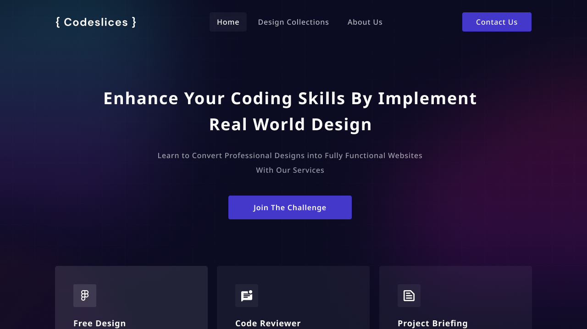

    

----------

# CodeSlices 🚀

Welcome to CodeSlices, a website dedicated to helping developers improve their coding skills through design slicing. Here you'll find a collection of free Figma designs that you can download and slice into code. 

The website was created by Alif Januantara, a student of Sistem Informasi as a task for web design subject, as a way to help other developers learn and improve their skills. So why not give it a try and see what you can slice?

### How to Use CodeSlices 🤔

1. Browse our collection of designs and find one that you like. 
2. Download the Figma file. 
3. Open the file in Figma and inspect the design.
4. Start slicing the design into code.
5. Use the resulting code for your project or further practice.

### Contributing 🤝

We are always looking for new designs to add to our collection, so if you have a design that you would like to share, please contact us. We would love to hear from you

### Contact 📱

If you have any questions or feedback, please feel free to contact at [lifznotes](mailto:lifznotes@gmail.com)

Thank you for visiting CodeSlices!
